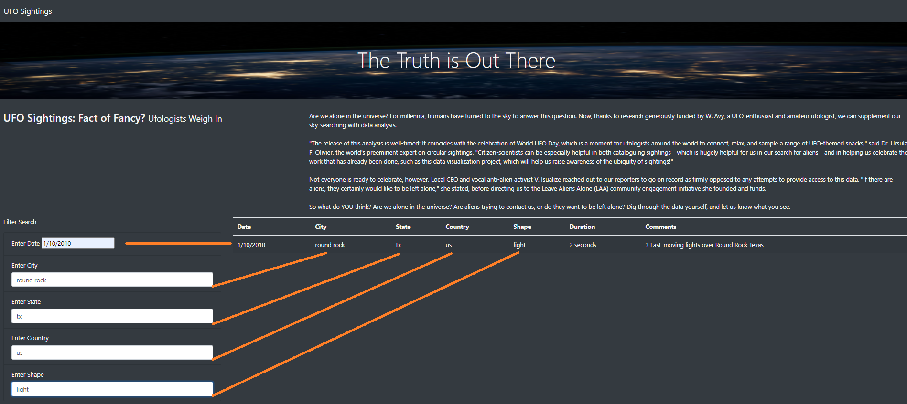

# UFOs  

  

## Overview of Project 
Dana’s webpage and dynamic table are working as intended, but she’d like to provide a more in-depth analysis of UFO sightings by allowing users to filter for multiple criteria at the same time. In addition to the date, you’ll add table filters for the city, state, country, and shape.  

## Results 
For this project, I built a table using data stored in a JavaScript array. I then created filters to make this table fully dynamic, meaning that it will respond to user input, and subsequently placed the table into an HTML file to produce effortless display.  I tailored the webpage using Bootstrap and had the table configured with several fully functional filters that will allow users to interact with the particulars of their searches.  

  

**Filter Search By Date** 
Here the user has the ability to search by a specific date.  The user needs to be aware that the date has to be in the correct date format to retrieve proper result(s). 
  

**Filter Search By City** 
Here the user has the option to enter a certain City to search for.  When entering in your city of choice, please be aware that the spelling needs to be exact to retrieve a result. 
  

**Filter Search By State** 
First thing the user will want to do if they were me is to see if there has been a sighting in the State I live in.  Enter the state abbreviation correctly and let us see if we get a hit. 
  

**Filter Search By Country** 
To search by Country, the user needs to enter in the current Country abbreviation correctly.
  

**Filter Search By Shape** 
Finally, if the user knows the shape of the sighting, please enter that in correctly to see all the results that will be filtered back. 
  

**Filtered Result** 
The proof is in the pudding - let us see if we have had a sighting near Austin, Texas.  I have entered a criteria in each of the filter/search boxes and sure enough - we have had one in Round Rock. 
  

## Summary 
After launching the newly designed website, I would like to offer an area of improvement for the new design as well as recommendations for further development. 

**Area for Improvement**  
Working through the filtered searches, it would serve the visitor of the website to be able to filter to their choice rather than have free-form text.  With the case sensitive nature of the filter box(es), the UFO website surfer could miss data they are looking for just based on the premise of a misspelled word or entering the date in the incorrect format.  Adding a Calendar option that launches a calendar to choose from, while self populating the correct format in the filtered boxes, would be a great functional enhancement. 

**Recommendations for Future Enhancement**  
First, we need to expand the data as well as clean the text of the data.  If we do not have clean data, the end user could question the validity of our data as well as our website.  To do this, we will use [The Blue Book of Grammar](https://www.grammarbook.com/) as our guide to clean up the text in all of our data fields.  Also, each visitor is going to first try to locate UFO sightings from their hometown or current residence.  We have a very limited amount of data which could translate to very limited traffic to the website.  
Second, we need to create a "Reset Filter" option.  If we enter multiple fields in our filter search boxes, we should give the user the ability to clear all inputs at one time.  Going back and deleting the inputs take away from the experience on the website - we want to increase and retain traffic, not lose it based on wasted clicks by the user.  
Finally,  I would like to explore adding a map visualization tab.  Nothing would be more exciting than to see a heat map created from the UFO sightings - are the East Coast of the United States seeing more sightings or could the Midwest of the US have a higher number of reported sightings?  To add that interaction and visualization will add the user experience while on our website and word of mouth about great websites travels quickly throughout social media. 

It has been a great pleasure to work on this website and if you have any questions, please do not hesitiate to reach out.
