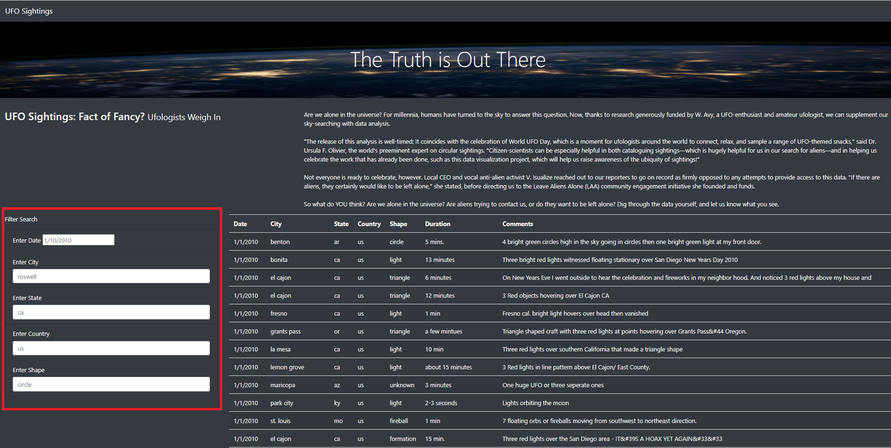
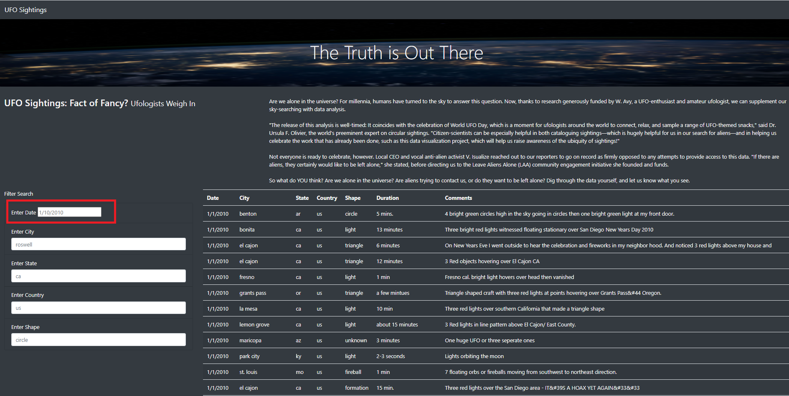
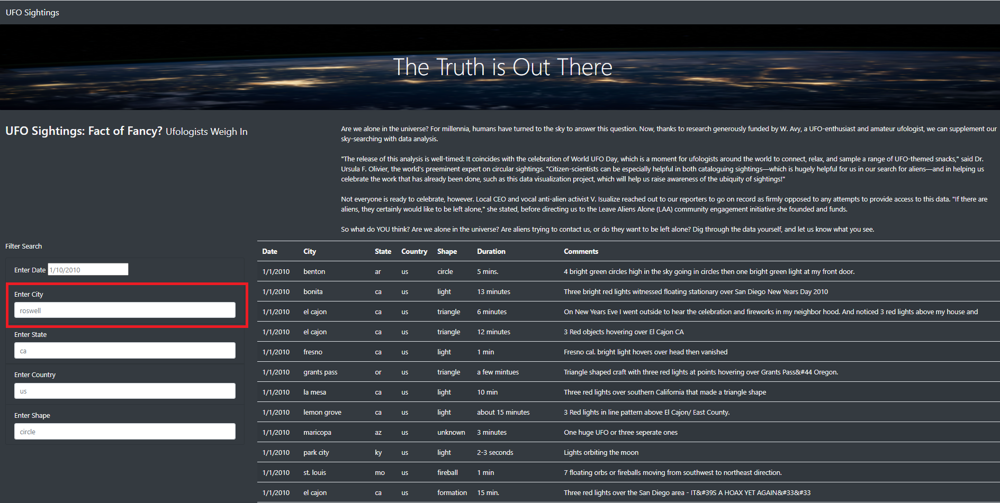
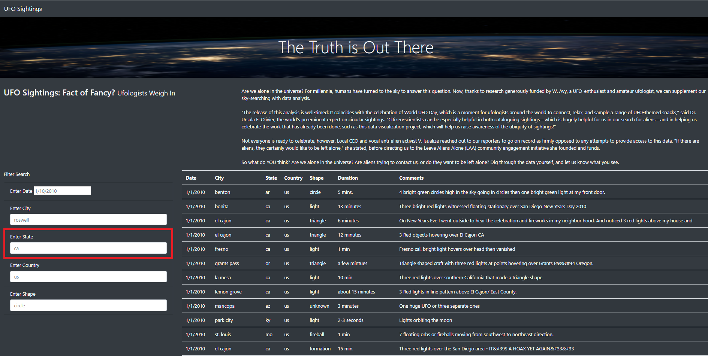
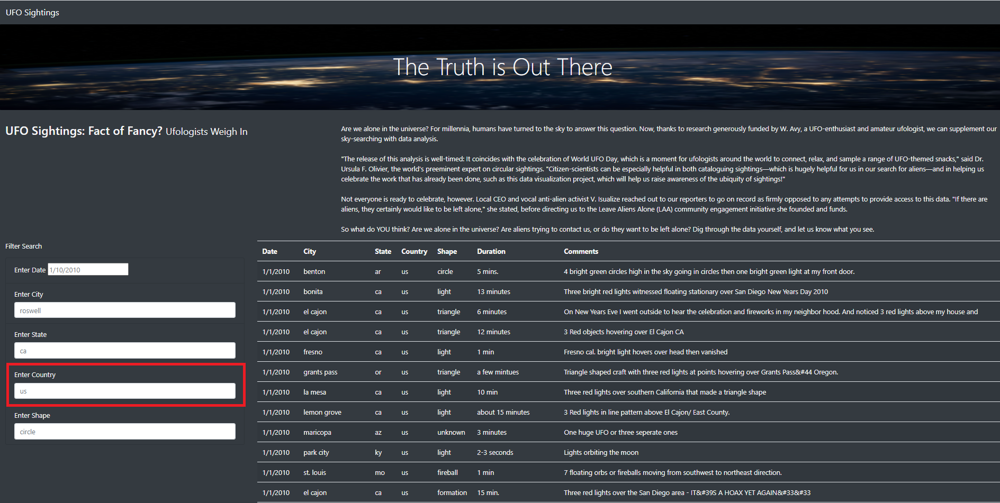
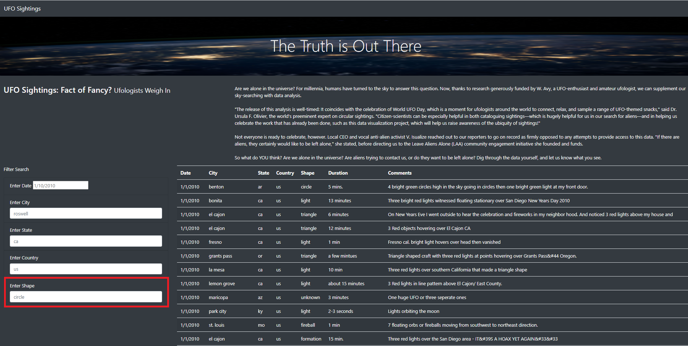

# UFOs  

  

## Overview of Project 
Dana’s webpage and dynamic table are working as intended, but she’d like to provide a more in-depth analysis of UFO sightings by allowing users to filter for multiple criteria at the same time. In addition to the date, you’ll add table filters for the city, state, country, and shape.  

## Results 
For this project, I built a table using data stored in a JavaScript array. I then created filters to make this table fully dynamic, meaning that it will respond to user input, and subsequently placed the table into an HTML file to produce effortless display.  I tailored the webpage using Bootstrap and had the table configured with several fully functional filters that will allow users to interact with the particulars of their searches.  

  

**Filter Search By Date**
  

**Filter Search By City**
  

**Filter Search By State**
  

**Filter Search By Country**
  

**Filter Search By Shape**
  

## Summary 
After launching the newly designed website, I would like to offer an area of improvement for the new design as well as recommendations for further development. 

**Area for Improvement**  
Working through the filtered searches, it would serve the visitor of the website to be able to filter to their choice rather than have free-form text.  With the case sensitive nature of the filter box(es), the UFO website surfer could miss data they are looking for just based on the premise of a misspelled word or entering the date in the incorrect format.  Adding a Calendar option that launches a calendar to choose from that will populate the correct format in the filtered boxes would be a great functional enhancement. 

**Recommendations for Future Enhancement** 
First, we need to expand the data as well as clean the text of the data.  If we do not have clean data, the end user could question the validity of our data as well as our website.  We need to use [The Blue Book of Grammar](https://www.grammarbook.com/) as our guide to clean up the text in all of our data fields. 
